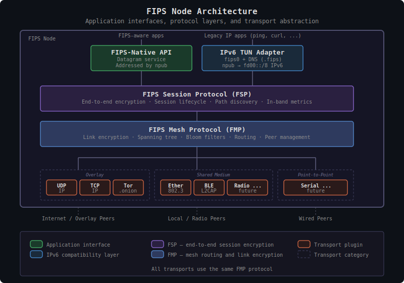

# FIPS: Free Internetworking Peering System

## What is FIPS?

FIPS is a self-organizing mesh network that can operate natively over a
variety of physical and logical media, such as local area networks,
Bluetooth, serial links, or the existing internet as an overlay. The
long-term goal is infrastructure that can function alongside or ultimately
replace dependence on the Internet itself. Systems running FIPS establish
peer connections, authenticate each other, and route traffic for each other
without any central authority or global topology knowledge, and allow
end-to-end encrypted sessions between any two nodes regardless of how many
hops separate them.

Nodes in the mesh route traffic for each other using Nostr identities
(npubs) as network addresses. Applications can access the mesh through a
native FIPS datagram service, or through an IPv6 adaptation layer that
presents each node as an IPv6 endpoint for compatibility with existing
IP-based applications.

## Why FIPS?

**Self-sovereign identity**: FIPS nodes generate their own addresses, node
IDs, and security credentials without coordination with any central
authority. These identities can be long-term fixed or may be ephemeral,
changed at any time. These identities are not visible to the FIPS network
itself — they are used only at the application layer and for end-to-end
session encryption.

**Infrastructure independence**: The internet depends on centralized
infrastructure — ISPs, backbone providers, DNS, certificate authorities.
FIPS works over any transport that can carry packets: a serial connection,
onion-routed connections through Tor, local area networking, radio links
between remote sites, or the existing internet as an overlay. When the
internet is unavailable, unreliable, or untrusted, the mesh still works.

**Privacy by design**: FIPS provides secure, authenticated, and encrypted
communication between any two nodes in the mesh, independent of the mix of
transports used along the routed path between them. Furthermore, the mesh
itself is designed to minimize metadata exposure — intermediate nodes route
packets without learning the identities of the endpoints.

**Zero configuration**: Nodes discover each other and build routing
automatically. Connect to one peer and you can reach the entire mesh. The
network self-heals around failures and adapts to changing topology.

## A Self-Organizing Mesh

Traditional networks are built top-down. A central authority assigns
addresses, configures routing tables, provisions hardware, and manages the
topology. If the authority disappears or the infrastructure fails, the
network fails with it. Nodes cannot reach each other without infrastructure
mediating the connection.

FIPS inverts this model. There is no central authority, no address
assignment service, no routing table pushed from above. Each node generates
its own identity from a cryptographic keypair. Each node independently
decides which peers to connect to and which transports to use. From these
local decisions alone, the network self-organizes:

- A **spanning tree** forms through distributed parent selection, giving
  every node a coordinate in the network without any node knowing the full
  topology
- **Bloom filters** propagate through gossip, so each node learns which
  peers can reach which destinations — again without global knowledge
- **Routing decisions** are made locally at each hop, using only the node's
  immediate peers and cached coordinate information

Each peer link and end-to-end session actively measures RTT, loss, jitter,
and goodput through a lightweight in-band Metrics Measurement Protocol
(MMP), providing operator visibility and a foundation for quality-aware
routing.

The result is a network that builds itself from the bottom up, heals around
failures automatically, and scales without central coordination. Adding a
node is as simple as connecting to one existing peer — the network
integrates the new node through its normal mesh protocols.

## Specific Design Goals

- **Nostr-native identity and cryptography** — Use Nostr keypairs as node
   identities and leverage secp256k1, Schnorr signatures, and SHA-256
- **Transport agnostic** — Support overlay, shared medium, and
   point-to-point transports transparently
- **Self-organizing** — Automatic topology discovery and route optimization
- **Privacy preserving** — Minimize metadata leakage across untrusted links
- **Resilient** — Self-healing with graceful degradation

Non-goals include:

- **Reliable delivery** — FIPS provides a best-effort datagram service;
  retransmission and ordering are left to applications or higher-layer
  protocols
- **Anonymity** — Direct peers learn each other's identity; FIPS minimizes
  metadata exposure but is not an anonymity network like Tor
- **Congestion control** — FIPS measures link quality but does not implement
  flow control or congestion avoidance at the mesh layer

---

## Protocol Architecture

FIPS is organized in three protocol layers, each with distinct
responsibilities and clean service boundaries. No layer depends on the
specifics of the layers above or below it — transport plugins know nothing
about sessions, the routing layer knows nothing about application addressing,
and applications know nothing about which physical media carry their traffic.
This separation means new transports, protocol features, and application
interfaces can be added independently.

### Mapping to Traditional Networking

Readers familiar with the OSI model or TCP/IP networking may find it helpful
to see how FIPS concepts relate to traditional layers:

Note that FMP spans what would traditionally be separate link and network
layers. This is intentional — in a self-organizing mesh, the same layer that
authenticates peers also makes routing decisions, because routing depends on
authenticated peer state (spanning tree positions, bloom filters).

### Layer Responsibilities

**Transport layer**: Delivers datagrams between endpoints over a specific
medium. Each transport type (UDP socket, Ethernet interface, radio modem)
implements the same abstract interface: send and receive datagrams, report
MTU. The transport layer knows nothing about FIPS identities, routing, or
encryption. It provides raw datagram delivery to FMP above.

See [fips-transport-layer.md](fips-transport-layer.md) for the transport layer
specification.

**FIPS Mesh Protocol (FMP)**: Manages peer connections, authenticates peers
via Noise IK handshakes, and encrypts all traffic on each link. FMP is where
the mesh organizes itself — nodes exchange spanning tree announcements and
bloom filters with their direct peers, and FMP makes forwarding decisions
for transit traffic. FMP provides authenticated, encrypted forwarding to FSP
above.

See [fips-mesh-layer.md](fips-mesh-layer.md) for the FMP specification and
[fips-mesh-operation.md](fips-mesh-operation.md) for how FMP's routing and
self-organization work in practice.

**FIPS Session Protocol (FSP)**: Provides end-to-end authenticated
encryption between any two nodes, regardless of how many intermediate hops
separate them. FSP manages session lifecycle (setup, data transfer,
teardown), caches destination coordinates for efficient routing, and handles
the warmup strategy that keeps transit node caches populated. Session
dispatch uses index-based routing inspired by
[WireGuard](https://www.wireguard.com/), enabling O(1) packet
demultiplexing. FSP provides a datagram service to applications above.

See [fips-session-layer.md](fips-session-layer.md) for the FSP specification.

**IPv6 adaptation layer**: Sits above FSP as a service on port 256, adapting
the FIPS datagram service for unmodified IPv6 applications. Provides DNS
resolution (npub → fd00::/8 address), identity cache management, IPv6 header
compression, MTU enforcement, and a TUN interface. This is the primary way
existing applications use the FIPS mesh.

See [fips-ipv6-adapter.md](fips-ipv6-adapter.md) for the IPv6 adapter.

### Node Architecture

Application services sit at the top of the stack, dispatched by FSP port
number: the IPv6 TUN adapter (port 256) maps npubs to `fd00::/8` addresses
with header compression so unmodified IP applications can use the network
transparently, while the native datagram API addresses destinations directly
by npub.

The mesh routes application traffic across heterogeneous transports
transparently. A packet may traverse WiFi, Ethernet, UDP/IP, and Tor links
on its way from source to destination — the application never needs to know
which transports are involved. Each hop is independently encrypted at the
link layer, while a single end-to-end session protects the payload across
the entire path.

---

## Identity System

FIPS uses [Nostr](https://github.com/nostr-protocol/nips) keypairs
(secp256k1) as node identities. The public key identifies the node; the
private key signs protocol messages and establishes encrypted sessions.

The public key (or its bech32-encoded npub form) is the primary means for
application-layer software to identify communication endpoints. Internally,
the protocol derives a `node_addr` (a 16-byte SHA-256 hash of the pubkey)
used as the routing identifier in packet headers, and an IPv6 address derived
from the node_addr for the TUN adapter. Applications use the pubkey or npub;
the routing layer uses node_addr; unmodified IPv6 applications use the
derived `fd00::/8` address. All three are deterministically derived from the
same keypair.

### FIPS Identity Handling

The pubkey is the node's cryptographic identity, used in Noise IK handshakes
for both link and session encryption. It is never exposed beyond the
endpoints of an encrypted channel. The node_addr, a one-way SHA-256 hash
truncated to 16 bytes, serves as the routing identifier in packet headers
and bloom filters. Intermediate routers see only node_addrs — they can
forward traffic without learning the Nostr identities of the endpoints. An
observer can verify "does this node_addr belong to pubkey X?" if they already
know the pubkey, but cannot enumerate communicating identities by inspecting
traffic. The IPv6
address prepends `fd` to the first 15 bytes of the node_addr, providing a
ULA overlay address for unmodified IP applications via the TUN interface.

Below the FIPS identity layer, each transport uses its own native addressing
— IP:port tuples, MAC addresses, .onion identifiers. These **link
addresses** are opaque to everything above FMP and discarded once link
authentication completes.

### Identity Verification

The Noise Protocol Framework mutually authenticates both peer-to-peer link
connections (at FMP) and end-to-end session traffic (at FSP), proving each
party controls the private key for their claimed identity.

See [fips-mesh-layer.md](fips-mesh-layer.md) for peer authentication and
[fips-session-layer.md](fips-session-layer.md) for end-to-end session
establishment.

Key rotation changes the node's identity — a new keypair produces a new
node_addr and IPv6 address, requiring all sessions to be re-established.
Migration mechanisms that allow a node to announce a successor key are a
future consideration.

---

## Two-Layer Encryption

FIPS uses independent encryption at two protocol layers:

| Layer | Scope | Pattern | Purpose |
| ----- | ----- | ------- | ------- |
| **FMP (Mesh)** | Hop-by-hop | Noise IK | Encrypt all traffic on each peer link |
| **FSP (Session)** | End-to-end | Noise XK | Encrypt application payload between endpoints |

### Link Layer (Hop-by-Hop)

When two nodes establish a direct connection, they perform a [Noise
IK](https://noiseprotocol.org/) handshake. This authenticates both parties
and establishes symmetric keys for encrypting all traffic on that link.
Every packet between direct peers is encrypted — gossip messages, routing
queries, and forwarded session datagrams alike.

The IK pattern is used because outbound connections know the peer's npub
from configuration, while inbound connections learn the initiator's identity
from the first handshake message.

### Session Layer (End-to-End)

FIPS establishes end-to-end encrypted sessions between any two communicating
nodes using Noise XK, regardless of how many hops separate them. The
initiator knows the destination's npub (required for XK's pre-message);
the responder learns the initiator's identity from the third handshake
message. Unlike the link-layer IK pattern where the initiator's identity
is revealed in msg1, XK delays identity disclosure until msg3, providing
stronger initiator identity protection for traffic traversing untrusted
intermediate nodes.

A packet from A to D through intermediate nodes B and C:

1. A encrypts payload with A↔D session key (FSP)
2. A wraps in SessionDatagram, encrypts with A↔B link key (FMP), sends to B
3. B decrypts link layer, reads destination node_addr, re-encrypts with B↔C
   link key, forwards to C
4. C decrypts link layer, re-encrypts with C↔D link key, forwards to D
5. D decrypts link layer, then decrypts session layer to get payload

Intermediate nodes route based on destination node_addr but cannot read
session-layer payloads. Each hop strips one link encryption and applies the
next — the session-layer ciphertext passes through untouched.

Both layers always apply, even between adjacent peers — a packet to a direct
neighbor is still encrypted twice. This uniform model means no special cases
for local vs remote destinations, and topology changes (a direct peer
becomes reachable only through intermediaries) don't affect existing
sessions.

See [fips-mesh-layer.md](fips-mesh-layer.md) for link encryption and
[fips-session-layer.md](fips-session-layer.md) for session encryption.

---

## Routing and Mesh Operation

Each node makes forwarding decisions using only local information — its
immediate peers, their bloom filters, and cached coordinates — rather than
centrally distributed routing tables or global topology knowledge. Two
complementary mechanisms provide the information each node needs.

### Spanning Tree: The Coordinate System

Nodes self-organize into a spanning tree through gossip — each node
exchanges announcements with its direct peers and independently selects a
parent. Because every node applies the same rule (prefer the root with the
smallest node_addr), the network converges on a single agreed-upon root
without any voting or coordination. This is the same principle behind the
[Spanning Tree
Protocol](https://en.wikipedia.org/wiki/Spanning_Tree_Protocol) used in
Ethernet bridging since the 1980s: purely local decisions that converge to
consistent global state. The resulting tree gives every node a
**coordinate** — its path from itself to the root. Using tree coordinates
for routing is adapted from
[Yggdrasil](https://yggdrasil-network.github.io/)'s
[Ironwood](https://github.com/Arceliar/ironwood) routing library.

These coordinates enable distance calculations between any two nodes: the
distance is the number of hops from each node to their lowest common
ancestor in the tree. This provides a metric for routing decisions without
any node needing to know the full network topology.

The tree maintains itself through gossip — nodes exchange TreeAnnounce
messages with their peers, propagating parent selections and ancestry
chains. Changes cascade through the tree proportional to depth, not network
size. If the network partitions, each segment converges to its own new root
through the same process and reconverges automatically when segments rejoin.

See [fips-spanning-tree.md](fips-spanning-tree.md) for the tree algorithms
and [spanning-tree-dynamics.md](spanning-tree-dynamics.md) for detailed
convergence walkthroughs.

### Bloom Filters: Candidate Selection

The spanning tree provides a coordinate system for distance-based routing,
but on its own each node would only know about its immediate neighbors.
Bloom filters complement the tree by distributing reachability knowledge
across the entire mesh — each node learns which destinations are reachable
through which peers, without any node needing a complete view of the
network.

Each node's peer-advertised [bloom
filter](https://en.wikipedia.org/wiki/Bloom_filter) is a compact, fixed-size
data structure that answers one question: "can this peer possibly reach
destination D?" The answer is either "no" (definitive) or "maybe"
(probabilistic — false positives are possible). Because the filter size is
constant regardless of how many destinations it represents, bloom filters
scale efficiently as the network grows. This is candidate selection for
routing — bloom filters narrow the set of peers worth considering, and the
actual forwarding decision ranks those candidates by tree distance and link
quality.

Filters propagate transitively through tree edges, with each node computing
outbound filters by merging the filters received from its tree peers (parent
and children) using a
[split-horizon](https://en.wikipedia.org/wiki/Split_horizon_route_advertisement)
technique borrowed from distance-vector routing. All peers — including
non-tree mesh shortcuts — receive FilterAnnounce messages, but only tree
peers' filters are merged into outgoing computation. This prevents filter
saturation where mesh shortcuts would cause every filter to converge toward
the full network.

See [fips-bloom-filters.md](fips-bloom-filters.md) for filter parameters and
mathematical properties.

The outbound filter for peer Q merges this node's identity with tree peer
inbound filters except Q's (split-horizon exclusion). This creates
directional asymmetry: upward filters (child → parent) contain the child's
subtree, while downward filters (parent → child) contain the complement.
Mesh peers receive filters but their inbound filters are not merged
transitively — they provide single-hop shortcut visibility only.

A node with multiple peers receives genuinely different filters from each.
In the diagram, R receives {B, D, E} from B and {C, F} from C — two disjoint
subtrees. When R needs to reach F, only C's filter matches. This is where
bloom filters provide real candidate selection: a node with several peers
can narrow the forwarding choice before consulting tree coordinates. Leaf
nodes like D have only one peer, so their single inbound filter is
necessarily near-complete (everything except themselves) and offers no
selection — but leaf nodes have no choice to make anyway.

Bloom filter sizing (bit count and hash functions) requires further analysis
based on actual deployment scenarios. The FMP wire format is versioned to
accommodate future parameter changes as operational experience accumulates.

### Routing Decisions

At each hop, FMP makes a local forwarding decision using the following
priority chain:

1. **Local delivery** — the destination is this node
2. **Direct peer** — the destination is an authenticated neighbor
3. **Bloom-guided candidate selection** — bloom filters identify peers that
   can reach the destination; tree coordinates rank them by distance and
   link quality
4. **[Greedy routing](https://en.wikipedia.org/wiki/Greedy_embedding)** —
   fallback when bloom filters haven't converged; forward to the peer that
   minimizes tree distance to the destination
5. **No route** — destination unreachable; send error signal to source

All multi-hop routing depends on knowing the destination's tree coordinates.
These are cached at each node after being learned through discovery
(LookupRequest/LookupResponse) or session establishment (SessionSetup). The
coordinate cache is the critical piece that enables efficient forwarding.

### Coordinate Caching and Discovery

When a node first needs to reach an unknown destination, it sends a
LookupRequest that propagates through the network guided by bloom filters
and loop prevention. The destination responds with its coordinates, which
the source and intermediate nodes along the return path cache. Subsequent
traffic routes efficiently using the cached coordinates.

Session establishment (SessionSetup) also carries coordinates, warming
transit node caches along the path so that data packets can be forwarded
without individual discovery at each hop.

### Error Recovery

When routing fails — because cached coordinates are stale, a path has
broken, or a packet exceeds a link's MTU — transit nodes signal the source:

- **CoordsRequired**: A transit node lacks the destination's coordinates.
  The source re-initiates discovery and resets its coordinate warmup
  strategy.
- **PathBroken**: Greedy routing reached a dead end. The source re-discovers
  the destination's current coordinates.
- **MtuExceeded**: A transit node cannot forward a packet because it exceeds
  the next-hop link MTU. The source adjusts its path MTU estimate.

All three signals trigger active recovery, and are rate-limited to prevent
storms during topology changes.

See [fips-mesh-operation.md](fips-mesh-operation.md) for the complete
routing and mesh behavior description.

### Metrics Measurement Protocol (MMP)

Each peer link runs an instance of the Metrics Measurement Protocol, which
measures link quality through in-band report exchange. MMP computes smoothed
round-trip time (SRTT), packet loss rate, interarrival jitter, goodput, and
one-way delay trend — all derived from counter and timestamp fields already
present in the FMP wire format, with no additional probing traffic required.

MMP operates in three modes. **Full** mode exchanges both SenderReports and
ReceiverReports to compute all metrics including RTT. **Lightweight** mode
exchanges only ReceiverReports, providing loss and jitter but not RTT — useful
for constrained links. **Minimal** mode disables reports entirely, relying
only on spin bit and congestion echo flags in the frame header.

Reports are sent at RTT-adaptive intervals (clamped to 100 ms–2 s), so
high-latency links don't generate excessive measurement traffic while
low-latency links converge quickly. Each metric carries both short-term and
long-term exponentially weighted moving averages, enabling detection of
quality changes against a stable baseline.

MMP serves dual roles: operator visibility and cost-based parent selection.
Periodic log lines report per-link RTT, loss, jitter, and goodput. MMP
computes an Expected Transmission Count (ETX) from bidirectional delivery
ratios, which feeds into cost-based parent selection where each node
evaluates `effective_depth = depth + link_cost` using
`link_cost = etx * (1.0 + srtt_ms / 100.0)`. ETX is not yet used in
`find_next_hop()` candidate ranking for data forwarding.

See [fips-mesh-layer.md](fips-mesh-layer.md) for MMP operating modes, report
scheduling, and the spin bit design.

---

## Transport Abstraction

FIPS treats the communication medium as a pluggable component. Every transport
— whether a UDP socket, an Ethernet interface, a Tor circuit, or a radio modem
— implements the same simple interface: send a datagram to an address, receive
datagrams, and report the link MTU. The rest of the protocol stack sees no
difference between them.

A **transport** is a driver for a particular medium. A **link** is a peer
connection established over a transport. Transport addresses (IP:port, MAC
address, .onion) are opaque to all layers above FMP — they exist only to
deliver datagrams and are discarded once FMP has authenticated the peer via
the Noise IK handshake. From that point on, the peer is identified solely by
its cryptographic identity.

Transports fall into three categories based on their connectivity model:

| Category | Examples | Characteristics |
| -------- | -------- | --------------- |
| Overlay | UDP/IP, Tor | Tunnels FIPS over existing networks |
| Shared medium | Ethernet, WiFi, Bluetooth, Radio | Local broadcast, peer discovery |
| Point-to-point | Serial, dialup | Fixed connections, no discovery |

These categories differ in addressing, MTU, reliability, and whether they
support local discovery, but FMP handles all of them uniformly. A node
running multiple transports simultaneously bridges between those networks
automatically — peers from all transports feed into a single spanning tree,
and the router selects the best path regardless of which medium carries it.
If one transport fails, traffic reroutes through alternatives without
application involvement.

Some transports support an optional discovery capability — the ability to
broadcast and listen for announcements indicating the availability of FIPS
endpoints on the local medium. Shared media like Ethernet, WiFi, Bluetooth,
and radio are natural fits for this, as they can reach nearby devices without
prior configuration. When discovery is available, nodes can automatically
find and peer with other FIPS nodes on the same medium. Transports that
lack discovery (such as configured UDP endpoints) simply skip this step and
connect directly to configured addresses. Additionally, endpoint discovery
using Nostr relays and signed events is planned, allowing internet-reachable
nodes to publish their transport addresses for other FIPS nodes to find.

NAT traversal is not currently addressed by the protocol.
Internet-connected nodes behind NAT must be reachable through port
forwarding, a publicly addressed peer, or relay through other mesh nodes.
UDP hole punching and relay-assisted NAT traversal are potential future
mechanisms but are not part of the current design.

> **Implementation status**: UDP/IP is implemented. Ethernet and Bluetooth
> transports are under active design and development. All others are future
> directions.

See [fips-transport-layer.md](fips-transport-layer.md) for the full transport
layer specification.

---

## Security

FIPS is designed around four classes of adversary, each addressed by a
different layer of the protocol.

### Transport Observers

A passive observer on the underlying transport — someone monitoring a WiFi
network, tapping an Ethernet segment, or inspecting UDP traffic — sees only
encrypted packets. The FMP link-layer Noise IK session encrypts all traffic
between direct peers, including routing gossip and forwarded session
datagrams. The observer can infer timing, packet sizes, and which transport
endpoints are exchanging traffic, but cannot read content or determine
FIPS-level node identities from the encrypted packets. Traffic analysis —
correlating timing and volume patterns across multiple vantage points to
infer communication relationships — is not defended against (see
[Specific Design Goals](#specific-design-goals)).

### Active Attackers on the Transport

An adversary who can inject, modify, drop, or replay packets on the
transport is also defeated by the FMP link-layer Noise IK session. Mutual
authentication prevents impersonation, AEAD encryption detects tampering,
and counter-based nonces with a sliding replay window reject replayed
packets.

### Other FIPS Nodes (Intermediate Routers)

The most important adversary class is the operators of other nodes in the
mesh — the peers that forward your traffic. FIPS treats every intermediate
router as potentially adversarial. The FSP session layer establishes a
completely independent Noise XK session between the communicating endpoints,
so intermediate nodes cannot read application payloads even though they
decrypt and re-encrypt the link-layer envelope at each hop.

Routing headers expose only the destination's node_addr — an opaque
SHA-256 hash of the actual public key. Intermediate routers can forward
traffic without learning which Nostr identities are communicating. An
observer can verify "does this node_addr belong to pubkey X?" if they
already know the pubkey, but cannot enumerate communicating identities by
inspecting routed traffic.

| Entity | Can See |
| ------ | ------- |
| Transport observer | Encrypted packets, timing, packet sizes |
| Direct peer | Your npub, traffic volume, timing |
| Intermediate router | Source and destination node_addrs, packet size |
| Destination | Your npub, payload content |

### Adversarial Nodes Disrupting the Mesh

Beyond passive observation, a malicious node could attempt to disrupt
routing by injecting false spanning tree announcements, advertising bogus
bloom filters, or claiming invalid tree positions. FMP mitigates these
through signed TreeAnnounce messages verified by direct peers, transitive
ancestry chain validation, replay protection via sequence numbers, and
discretionary peering — node operators choose who to peer with, so an
attacker with many identities still needs real nodes to accept their
connections. Handshake rate limiting further constrains how fast an attacker
can establish new links. In fully open networks with automatic peer
discovery, Sybil resistance relies primarily on rate limiting; discretionary
peering provides stronger resistance in curated deployments where operators
vet their peers. An attacker who controls all of a target node's direct
peers can completely control its view of the network (an eclipse attack);
diverse peering across independent operators and transports is the primary
mitigation.

---

## Prior Work

FIPS builds on proven designs rather than inventing new cryptography or routing
algorithms. Nearly every major design decision has deployed precedent.

### Spanning Tree Self-Organization

The idea that distributed nodes can build a spanning tree through purely local
decisions — each node selecting a parent based on announcements from its
neighbors — dates to the
[IEEE 802.1D Spanning Tree Protocol](https://en.wikipedia.org/wiki/Spanning_Tree_Protocol)
(STP, 1985). STP demonstrated that a network-wide tree emerges from a simple
deterministic rule (lowest bridge ID wins root election) applied independently
at each node. FIPS uses the same principle — lowest node address determines the
root — adapted from an Ethernet bridging context to a general-purpose overlay
mesh.

### Tree Coordinate Routing

The spanning tree coordinates, bloom filter candidate selection, and greedy
routing algorithms are adapted from
[Yggdrasil v0.5](https://yggdrasil-network.github.io/2023/10/22/upcoming-v05-release.html)
and its [Ironwood](https://github.com/Arceliar/ironwood) routing library.
Yggdrasil's key insight was using the tree path from root to node as a
routable coordinate, enabling greedy forwarding without global routing tables.
FIPS adapts these algorithms for multi-transport operation, Nostr identity
integration, and constrained MTU environments.

The theoretical foundation for greedy routing on tree embeddings draws on
[Kleinberg's work](https://www.cs.cornell.edu/home/kleinber/swn.pdf) on
navigable small-world networks, which showed that greedy forwarding succeeds
in O(log² n) steps when the network has hierarchical structure. Thorup-Zwick
compact routing schemes separately demonstrated that sublinear routing state
is achievable with bounded stretch, motivating the use of tree coordinates
rather than full routing tables.

### Split-Horizon Bloom Filter Propagation

FIPS distributes reachability information using bloom filters computed with a
split-horizon rule: when advertising to a peer, exclude that peer's own
contributions. This technique is borrowed from distance-vector routing
protocols — [RIP](https://en.wikipedia.org/wiki/Routing_Information_Protocol)
(1988) and [Babel](https://www.irif.fr/~jch/software/babel/) use split-horizon
to prevent routing loops by not advertising a route back to the neighbor it was
learned from. FIPS applies the same principle to probabilistic set
advertisements rather than distance-vector tables.

### Cryptographic Identity as Network Address

FIPS nodes are identified by their Nostr public keys (secp256k1). The network
address *is* the cryptographic identity — there is no separate address
assignment or registration step.
[CJDNS](https://github.com/cjdelisle/cjdns) pioneered this approach in
overlay meshes, deriving IPv6 addresses from the double-SHA-512 of each node's
public key. Tor [.onion addresses](https://spec.torproject.org/rend-spec-v3)
and the IETF
[Host Identity Protocol](https://en.wikipedia.org/wiki/Host_Identity_Protocol)
(HIP) follow the same principle. FIPS uses Nostr's existing key infrastructure
rather than introducing a new identity scheme.

### Dual-Layer Encryption

FIPS encrypts traffic twice: FMP provides hop-by-hop link encryption
(protecting against transport-layer observers), while FSP provides independent
end-to-end session encryption (protecting against intermediate FIPS nodes).
This layered approach mirrors [Tor](https://www.torproject.org/), where each
relay peels one layer of encryption (hop-by-hop) while the innermost layer
protects end-to-end payload. [I2P](https://geti2p.net/) uses a similar
garlic routing scheme with tunnel-layer and end-to-end encryption. Unlike Tor
and I2P, FIPS does not provide anonymity — its dual encryption protects
confidentiality and integrity rather than hiding traffic patterns.

### Noise Protocol Framework

FIPS uses the [Noise Protocol Framework](https://noiseprotocol.org/) at both
protocol layers, with different handshake patterns chosen for each layer's
threat model. FMP link encryption uses **Noise IK**, providing mutual
authentication with a single round trip where the initiator knows the
responder's static key in advance.
[WireGuard](https://www.wireguard.com/) uses the same IK base pattern
(extended with a pre-shared key as IKpsk2) for VPN tunnels. FSP session
encryption uses **Noise XK**, the same pattern used by the
[Lightning Network](https://github.com/lightning/bolts/blob/master/08-transport.md),
where the initiator's static key is transmitted in a third message rather
than the first. XK provides stronger initiator identity hiding at the cost
of an additional round trip — a worthwhile tradeoff for session-layer traffic
that traverses untrusted intermediate nodes. At the link layer, where both
peers are configured and directly connected, IK's single round trip is
preferred.

### Index-Based Session Dispatch

FIPS uses locally-assigned 32-bit session indices to demultiplex incoming
packets to the correct cryptographic session in O(1) time, without parsing
source addresses or performing expensive lookups. This directly follows
[WireGuard's](https://www.wireguard.com/papers/wireguard.pdf) receiver index
approach, where each peer assigns a random index during handshake and the
remote side includes it in every packet header.

### Transport-Agnostic Overlay Mesh

FIPS is designed to operate over any datagram-capable transport — UDP, raw
Ethernet, Bluetooth, radio, serial — through a uniform transport abstraction.
Several mesh overlays have demonstrated transport-agnostic design:
[CJDNS](https://github.com/cjdelisle/cjdns) runs over UDP and Ethernet,
[Yggdrasil](https://yggdrasil-network.github.io/) supports TCP and TLS
transports, and [Tor](https://www.torproject.org/) can use pluggable
transports to tunnel through various media. FIPS extends this pattern to
shared-medium transports (radio, BLE) with per-transport MTU and discovery
capabilities.

### Metrics Measurement Protocol

MMP's design assembles well-established measurement techniques into a unified
per-link protocol. The SenderReport/ReceiverReport exchange structure follows
[RTCP](https://www.rfc-editor.org/rfc/rfc3550) (RFC 3550), which uses the
same report pairing for media stream quality monitoring in RTP sessions. MMP's
jitter computation uses the RTCP interarrival jitter algorithm directly.

The smoothed RTT estimator uses the Jacobson/Karels algorithm
([RFC 6298](https://www.rfc-editor.org/rfc/rfc6298)), the same SRTT
computation used in TCP for retransmission timeout calculation since 1988.
MMP derives RTT from timestamp-echo in ReceiverReports with dwell-time
compensation, rather than from packet round-trips.

The spin bit in the FMP frame header follows the
[QUIC](https://www.rfc-editor.org/rfc/rfc9000) spin bit
([RFC 9312](https://www.rfc-editor.org/rfc/rfc9312)) — a single bit that
alternates each round trip, enabling passive latency measurement. FIPS
implements the spin bit state machine but relies on timestamp-echo for SRTT,
as irregular mesh traffic makes spin bit RTT unreliable.

The Expected Transmission Count (ETX) metric, computed from bidirectional
delivery ratios, was introduced by
[De Couto et al. (2003)](https://pdos.csail.mit.edu/papers/grid:mobicom03/paper.pdf)
for wireless mesh routing and is used in protocols including
[OLSR](https://en.wikipedia.org/wiki/Optimized_Link_State_Routing_Protocol)
and [Babel](https://www.irif.fr/~jch/software/babel/). FIPS computes ETX
per-link from MMP loss measurements for future use in candidate ranking.

The CE (Congestion Experienced) echo flag provides hop-by-hop
[ECN](https://en.wikipedia.org/wiki/Explicit_Congestion_Notification)
signaling, following the TCP/IP ECN echo pattern (RFC 3168). Transit nodes
detect congestion via MMP loss/ETX metrics or kernel buffer drops and set
the CE flag on forwarded frames; destination nodes mark ECN-capable IPv6
packets accordingly.

### Cryptographic Primitives

FIPS reuses [Nostr's](https://github.com/nostr-protocol/nips) cryptographic
stack — secp256k1 for identity keys, Schnorr signatures for authentication,
SHA-256 for hashing, and ChaCha20-Poly1305 for authenticated encryption. This
is the same primitive set used across Bitcoin, Nostr, and a growing ecosystem
of self-sovereign identity systems. No novel cryptography is introduced.

---

## Further Reading

### Protocol Layers

| Document | Description |
| -------- | ----------- |
| [fips-transport-layer.md](fips-transport-layer.md) | Transport layer: abstraction, types, services provided to FMP |
| [fips-mesh-layer.md](fips-mesh-layer.md) | FMP: peer authentication, link encryption, forwarding |
| [fips-session-layer.md](fips-session-layer.md) | FSP: end-to-end encryption, session lifecycle |
| [fips-ipv6-adapter.md](fips-ipv6-adapter.md) | IPv6 adaptation: DNS, TUN interface, MTU enforcement |

### Mesh Behavior and Wire Formats

| Document | Description |
| -------- | ----------- |
| [fips-mesh-operation.md](fips-mesh-operation.md) | How the mesh operates: routing, discovery, error recovery |
| [fips-wire-formats.md](fips-wire-formats.md) | Complete wire format reference for all protocol layers |

### Supporting References

| Document | Description |
| -------- | ----------- |
| [fips-spanning-tree.md](fips-spanning-tree.md) | Spanning tree algorithms and data structures |
| [fips-bloom-filters.md](fips-bloom-filters.md) | Bloom filter parameters, math, and computation |
| [spanning-tree-dynamics.md](spanning-tree-dynamics.md) | Scenario walkthroughs: convergence, partitions, recovery |

### Implementation

| Document | Description |
| -------- | ----------- |
| [fips-configuration.md](fips-configuration.md) | YAML configuration reference |

### External References

- [IEEE 802.1D Spanning Tree Protocol](https://en.wikipedia.org/wiki/Spanning_Tree_Protocol)
- [Yggdrasil Network](https://yggdrasil-network.github.io/)
- [Yggdrasil v0.5 Release Notes](https://yggdrasil-network.github.io/2023/10/22/upcoming-v05-release.html)
- [Ironwood Routing Library](https://github.com/Arceliar/ironwood)
- [Kleinberg — The Small-World Phenomenon](https://www.cs.cornell.edu/home/kleinber/swn.pdf)
- [CJDNS](https://github.com/cjdelisle/cjdns)
- [Tor Project](https://www.torproject.org/)
- [I2P](https://geti2p.net/)
- [Host Identity Protocol (HIP)](https://en.wikipedia.org/wiki/Host_Identity_Protocol)
- [Babel Routing Protocol](https://www.irif.fr/~jch/software/babel/)
- [Noise Protocol Framework](https://noiseprotocol.org/)
- [WireGuard](https://www.wireguard.com/)
- [WireGuard Whitepaper](https://www.wireguard.com/papers/wireguard.pdf)
- [Lightning Network BOLT #8 — Transport](https://github.com/lightning/bolts/blob/master/08-transport.md)
- [QUIC (RFC 9000)](https://www.rfc-editor.org/rfc/rfc9000)
- [QUIC Spin Bit (RFC 9312)](https://www.rfc-editor.org/rfc/rfc9312)
- [RTCP (RFC 3550)](https://www.rfc-editor.org/rfc/rfc3550)
- [TCP SRTT / RTO (RFC 6298)](https://www.rfc-editor.org/rfc/rfc6298)
- [ECN (RFC 3168)](https://www.rfc-editor.org/rfc/rfc3168)
- [ETX — De Couto et al. 2003](https://pdos.csail.mit.edu/papers/grid:mobicom03/paper.pdf)
- [OLSR](https://en.wikipedia.org/wiki/Optimized_Link_State_Routing_Protocol)
- [Nostr Protocol](https://github.com/nostr-protocol/nips)
